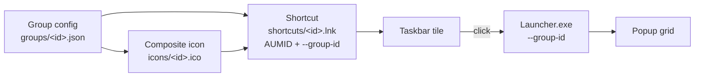

# TaskbarFolders

[](https://github.com/eXORR6077/taskbar-grouping/actions/workflows/ci.yml)
[](https://github.com/eXORR6077/taskbar-grouping/releases)
[](LICENSE)

**iOS-style app folders for the Windows 11 taskbar.** Group related apps behind a single pinned tile; click it and they fan out in a popup anchored to the tile.

> **Status:** v0.4.4, in active use. See [CHANGELOG.md](CHANGELOG.md) for what changed in each release.

<!-- Screenshots: drop PNGs into assets/screenshots/ and uncomment.


-->

## What it does

- **Groups of apps behind one taskbar tile.** Drag `.exe` or `.lnk` files into a group; the group gets its own pinnable shortcut.
- **Composite group icons.** Each group's icon is generated from the icons of the apps inside it — one centred, two side by side, three in an iOS-style arrangement, four or more as a 2×2 of the first four.
- **One-click pinning.** The Manager asks Windows to pin the group for you. Windows shows its own confirmation dialog; if your edition or policy blocks programmatic pinning, the Manager opens the shortcut folder so you can pin it by hand.
- **A popup with no chrome.** Clicking a pinned group opens a fully transparent popup next to the taskbar — only the icons are visible. It closes when it loses focus or after you launch something.
- **Follows your Windows theme.** Light, dark, or system; the system option live-switches when Windows does.
- **Multi-monitor and high-DPI aware.** The popup anchors to the monitor under the cursor and places correctly at 100–200 % display scaling.

## What it is not

- Not a taskbar replacement or shell extension — it adds pinned shortcuts, it does not hook Explorer.
- Not a launcher with search, hotkeys or recents. The popup is a grid of the apps you put in the group, nothing more.
- Not portable across Windows versions in every respect: the Mica backdrop needs Windows 11 22H2+, and one-click pinning needs Windows 10 2004+ (see [Requirements](#requirements)).

## Requirements

| | |
|---|---|
| **OS** | Windows 11 recommended. The installer permits Windows 10 1809 and later. |
| **.NET runtime** | Not required — releases are self-contained. |
| **Architecture** | x64. There is no ARM64 build. |

Two features degrade gracefully on older builds rather than failing:

- **One-click pinning** needs `Windows.UI.Shell.TaskbarManager` (Windows 10 2004 / build 19041 and later) and an edition that permits programmatic pinning. Where it is unavailable the Manager falls back to opening the shortcut folder for a manual pin.
- **The Mica backdrop** on the Manager window needs Windows 11 22H2 or later. Older builds get solid backgrounds.

## Installation

### Installer

1. Download `TaskbarFolders-Setup.exe` from [Releases](https://github.com/eXORR6077/taskbar-grouping/releases).
2. Run it. The installer requires administrator rights because it writes to Program Files, and offers to start TaskbarFolders with Windows (this option is pre-selected).
3. Launch **TaskbarFolders Manager** from the Start menu.

### Portable

1. Download `TaskbarFolders-portable.zip` from [Releases](https://github.com/eXORR6077/taskbar-grouping/releases).
2. Extract it anywhere. Keep the `Manager` and `Launcher` folders side by side — the Manager locates the launcher relative to itself.
3. Run `Manager\TaskbarFolders.Manager.exe`.

## Quick start

1. Open **TaskbarFolders Manager**.
2. Type a group name in the sidebar box and click **+ Add**. The button stays disabled until the name is non-empty.
3. Drop `.exe` or `.lnk` files onto the group's app list, or use **Add app…**. The composite icon preview updates as you go.
4. Click **Pin to taskbar**. Windows asks you to confirm — that prompt comes from Windows and cannot be skipped.
5. Click the new taskbar tile. The popup opens; click any icon to launch it.

If step 4 reports that pinning is unavailable, the Manager opens the shortcut folder for you. Right-click the `.lnk` there → **Show more options** (on Windows 11 22H2+) → **Pin to taskbar**. The same folder is reachable any time via **Show shortcut…**.

A group with no apps in it produces no icon and no shortcut, so add at least one app before pinning.

## How it works

Every group gets its own `.lnk` in `%APPDATA%\TaskbarFolders\shortcuts\`. The shortcut points at the **one shared** `TaskbarFolders.Launcher.exe`, passes `--group-id`, uses the group's generated `.ico`, and carries a distinct AppUserModelID (`TaskbarFolders.Group.<id>`) stamped through `IPropertyStore`. Windows treats each AppUserModelID as a separate application, which is what makes the groups sit next to each other on the taskbar as independent tiles.

A matching shortcut is also written into the Start menu. That copy is not cosmetic: Windows only persists a programmatic pin if the AppUserModelID is already known to the Start menu index.



Full detail in [docs/architecture.md](docs/architecture.md), and the reasoning behind the shared-launcher design in [ADR-002](docs/adr/002-per-group-lnk-aumid.md).

## Settings

Open with the **⚙** button. Changes apply when you click **Save**; closing the dialog discards them.

| Setting | Options | Default |
|---|---|---|
| Theme | System, Light, Dark | System |
| Popup position | Auto, Above, Below | Auto |
| Enable popup animations | on / off | on |
| Start TaskbarFolders Manager when Windows starts | on / off | off |

Autostart is a per-user `HKCU\…\CurrentVersion\Run` entry — no scheduled task, no service. The registry is read as the source of truth, so removing that entry by hand is respected.

## Where your data lives

Everything is under `%APPDATA%\TaskbarFolders\`:

| Path | Contents |
|---|---|
| `groups\<id>.json` | One file per group. The file name is the group id; the `id` field inside is ignored on load. |
| `icons\<id>.ico` | Generated composite icon, 16/32/48/256 px. |
| `icons\cache\<hash>.png` | Extracted source icons, keyed by path, write time and size. Pruned after 30 days. |
| `shortcuts\<id>.lnk` | The pinnable shortcut. |
| `settings.json` | Global settings. |
| `logs\manager-*.log`, `logs\launcher-*.log` | One file per day, kept 14 days. |

A per-group `columns` value (1–6, default 3) controls the popup grid width. There is no UI for it yet — edit the group's JSON to change it.

Uninstalling does **not** remove this folder. Delete `%APPDATA%\TaskbarFolders` by hand if you want the configuration gone, and unpin any group tiles first — deleting a group in the Manager does not unpin it.

## Troubleshooting

Start with the logs in `%APPDATA%\TaskbarFolders\logs\`; the launcher records every failure path there, including the exit code. [docs/troubleshooting.md](docs/troubleshooting.md) maps the common symptoms — a tile that does nothing, a pin that produces no tile, a popup in the wrong place at scaled resolutions — to their causes and fixes, and lists the current known limitations.

## Building from source

Requires the [.NET 8 SDK](https://dotnet.microsoft.com/download/dotnet/8.0) (pinned to 8.0.100 in `global.json`, rolling forward to a newer major) on Windows.

```bash
git clone https://github.com/eXORR6077/taskbar-grouping.git
cd taskbar-grouping
dotnet build TaskbarFolders.sln -c Release
```

```bash
dotnet test TaskbarFolders.sln -c Release
```

```bash
dotnet format TaskbarFolders.sln --verify-no-changes
```

The format check is a hard CI gate — run it before pushing. Tests need the `Microsoft.WindowsDesktop.App 8.0.x` runtime; if the machine only has a newer major, prefix with `DOTNET_ROLL_FORWARD=LatestMajor`. See [docs/developer-guide.md](docs/developer-guide.md) for the full setup, the analyzer rules the build enforces, and how to run the launcher directly.

## Project structure

```
taskbar-grouping/
├── src/
│   ├── TaskbarFolders.Shared/      # Models, JSON persistence, file logging
│   ├── TaskbarFolders.Core/        # Icon engine, Win32/COM interop, shortcut generation
│   ├── TaskbarFolders.Manager/     # WPF app for creating and managing groups
│   └── TaskbarFolders.Launcher/    # Per-group popup, invoked by the pinned shortcut
├── tests/                          # xUnit test projects, one per source project
├── docs/                           # Guides and architecture decision records
├── installer/                      # Inno Setup script
└── assets/                         # Application icons
```

| Component | Technology |
|---|---|
| Language / runtime | C# 12, .NET 8 |
| UI | WPF, MVVM via CommunityToolkit.Mvvm |
| DI | Microsoft.Extensions.DependencyInjection |
| Shell integration | Win32 P/Invoke + COM (`IShellLinkW`, `IPropertyStore`, `IImageList`), WinRT `TaskbarManager` |
| Tests | xUnit, Moq, FluentAssertions |
| Packaging | Inno Setup, self-contained `win-x64` publish |
| CI/CD | GitHub Actions |

## Documentation

- [User Guide](docs/user-guide.md) — everything the app can do, from a user's point of view
- [Troubleshooting](docs/troubleshooting.md) — symptoms, causes, known limitations
- [Architecture](docs/architecture.md) — components, data flow, runtime layout
- [Developer Guide](docs/developer-guide.md) — build, test, debug, conventions
- [API Reference](docs/api-reference.md) — the public surface of the libraries
- [Release Process](docs/release-process.md) — version bumps, tagging, verification
- [Architecture Decision Records](docs/adr/README.md) — why things are the way they are

## Contributing

See [CONTRIBUTING.md](CONTRIBUTING.md) for the branching model, commit conventions and the checks that must pass. Bug reports and feature requests go through the [issue templates](.github/ISSUE_TEMPLATE); [SUPPORT.md](SUPPORT.md) explains where to ask questions, and [SECURITY.md](SECURITY.md) covers vulnerability reporting.

## License

MIT — see [LICENSE](LICENSE). Third-party components are listed in [THIRD-PARTY-NOTICES.md](THIRD-PARTY-NOTICES.md).
