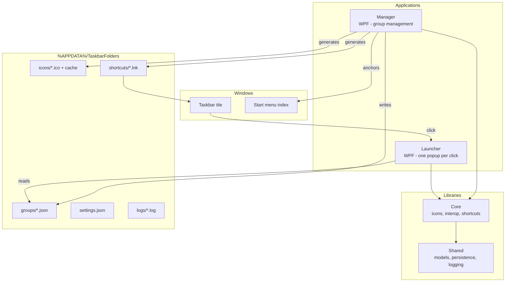
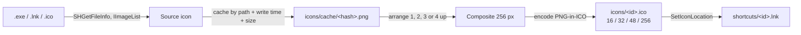

# Architecture

How TaskbarFolders is put together, and why. For the reasoning behind individual decisions see the [ADRs](adr/README.md).

## System overview

Two executables and two libraries. Dependencies flow one way: Manager and Launcher both depend on Core and Shared; Core depends on Shared; Shared depends on nothing of ours.

## Components

| Project | Role | Constraint |
|---|---|---|
| `TaskbarFolders.Shared` | Models, JSON persistence with atomic writes, path provider, file logging | No Windows-only APIs — kept portable |
| `TaskbarFolders.Core` | Icon extraction and composition, Win32/COM interop, shortcut generation, shell change notification, window backdrop | `[SupportedOSPlatform("windows")]` |
| `TaskbarFolders.Manager` | WPF application for group CRUD, settings, pinning | DI graph in `ManagerServiceCollectionExtensions` |
| `TaskbarFolders.Launcher` | Short-lived popup process, one per tile click; also the pin runner | DI graph in `LauncherServiceCollectionExtensions` |

The Launcher targets `net8.0-windows10.0.19041.0` rather than `net8.0-windows`; it needs the Windows 10 1903+ SDK projections to reach `Windows.UI.Shell.TaskbarManager`. Everything else targets `net8.0-windows`. This asymmetry is load-bearing — see [Locating the launcher](#locating-the-launcher).

## Grouping: one launcher, many identities

There is exactly **one** `TaskbarFolders.Launcher.exe`. Groups are not separate binaries; they are separate *shell identities* pointing at that one binary.

Each group gets a `.lnk` in `%APPDATA%\TaskbarFolders\shortcuts\` that:

- targets the shared launcher executable,
- passes `--group-id "<id>"` as its arguments,
- takes its icon from the group's generated `.ico`,
- and carries `PKEY_AppUserModel_ID` = `TaskbarFolders.Group.<id>`, written through `IPropertyStore`.

Windows groups taskbar buttons by AppUserModelID, so distinct AUMIDs give each group its own tile even though every tile starts the same executable. The launcher recovers the group id from `--group-id`, falling back to `GetCurrentProcessExplicitAppUserModelID` and stripping the prefix when Windows starts it without arguments.

The rejected alternative — a copy of the launcher per group with the icon written into the PE via `UpdateResource` — is recorded in [ADR-002](adr/002-per-group-lnk-aumid.md). Unsigned, dynamically modified executables trip Defender heuristics.

### The Start menu anchor

A second copy of each shortcut is written to `%APPDATA%\Microsoft\Windows\Start Menu\Programs\TaskbarFolders\`, followed by `SHChangeNotify(SHCNE_CREATE, SHCNF_PATHW | SHCNF_FLUSH, …)`.

This is not decoration. `TaskbarManager.RequestPinCurrentAppAsync` trusts the calling AUMID and can report success while persisting nothing if the shell's AppsFolder index has not yet seen a matching shortcut. The anchor plus the change notification is what makes a programmatic pin stick. `GroupSyncService` also re-checks every group's anchor on Manager startup, so configurations written by older versions heal themselves.

## Data flow

### Creating and syncing a group

1. The Manager creates a `GroupConfig` with a GUID id and writes `groups/<id>.json`. Writes go to a `.tmp` file and are then moved over the target, so a crash mid-write cannot truncate a config.
2. Adding apps triggers a sync. Sync **returns early for an empty group** — no apps means no icon and no shortcut, and therefore nothing to pin.
3. Icons for the first four apps are extracted at 128 px through the icon cache. `.lnk` inputs are resolved to their targets first.
4. Those icons are composed into one image: one centred, two side by side, three in an iOS-style arrangement, four as a 2×2 grid.
5. The composite is written as a multi-resolution PNG-in-ICO container (16/32/48/256 px) to `icons/<id>.ico`, again atomically.
6. The `.lnk` is generated with the AUMID and icon reference described above, and the Start menu anchor is written and announced.

If every icon extraction fails, sync stops before writing a shortcut rather than producing a group tile with no icon.

### Pinning

Two paths, both offered in the UI.

**One-click.** The Manager spawns the launcher as `TaskbarFolders.Launcher.exe --pin-mode --group-id <id>` and waits up to two minutes for it to exit. In pin mode the launcher stamps its own AUMID, shows a 1×1 transparent host window so the WinRT dialog has a foreground parent, waits briefly for the shell index to settle, and calls `RequestPinCurrentAppAsync`. Windows displays its own consent dialog — that step cannot be automated. The child's exit code carries the outcome back:

| Exit code | Meaning |
|---|---|
| 0 | Pinned |
| 1 | The user declined |
| 2 | Pinning unavailable — `TaskbarManager` absent, or blocked by edition or policy |
| 3 | Unexpected failure |
| 5 | Reported as pinned, but no pinned shortcut carrying the group's AUMID was found |

On codes 2 and 3 the Manager opens the shortcut folder so the user can pin manually.

**Manual.** **Show shortcut…** opens Explorer with the group's `.lnk` selected, for a right-click → *Pin to taskbar*.

### Clicking a pinned group

The taskbar starts the launcher. Startup order matters and is deliberate:

1. Set per-monitor-V2 DPI awareness.
2. Capture the cursor position — after the DPI call, so the coordinates are genuinely physical. If the call fails, fall back to the centre of the primary screen.
3. Stamp the AUMID unless one was inherited.
4. Load settings, build the DI graph, seed the cursor anchor, apply the theme.
5. Load the group, show the popup, activate it, then start icon extraction in the background.

Names appear immediately; icons stream in afterwards on the thread pool. Each `BitmapSource` is frozen inside the producer before the continuation crosses back to the UI thread — an unfrozen bitmap carries the wrong dispatcher affinity and the WPF binding throws.

The popup closes on focus loss, after a successful launch, or via a three-second fallback if Windows never granted it activation. A *failed* launch keeps it open and shows an inline error strip.

Popup width comes from the column count, but height is *measured*, not calculated: the strip docks to the bottom of a fill-last `DockPanel`, so at a height derived from tile rows alone it takes its space out of the fixed 96 px tiles and clips the last row. Sizing therefore measures `ChromeRoot` and clamps its `DesiredSize` between `MinHeight` and `MaxHeight`, which accounts for the strip without any code knowing it exists. Every time `LastError` appears or clears, the window is resized and placement recomputed so the popup still clears the taskbar.

The strip's `Visibility` is a plain `OneWay` binding and must stay one. Writing that property from code — to force the strip visible for a measure pass, say — replaces the binding with a local value and discards the expression permanently; `ClearValue` then removes only the local value, and `Visibility` falls back to its default, `Visible`. The strip survives as an empty red bar and clips the tiles again on the next click, because `LaunchApp` clears `LastError` before every attempt. Where the binding's timing matters, `BindingExpression.UpdateTarget()` pushes the current source value through without taking the property over.

### Launcher exit codes

Popup-mode startup uses its own codes, all written to `logs/launcher-*.log` before shutdown:

| Exit code | Meaning |
|---|---|
| 1 | No group id — neither `--group-id` nor a usable AUMID |
| 3 | Startup threw |
| 4 | Unhandled dispatcher exception after startup |

Every failure path goes through a dependency-free startup logger rather than `Trace`. This is a direct response to the v0.4.x regression in which every tile click exited with code 3 for weeks while the log stayed empty.

## Popup placement and the DPI contract

Everything crossing the Win32 boundary — taskbar and monitor rectangles, the cursor position, the anchor — is in **device pixels**. Placement converts to WPF device-independent pixels exactly once, using the effective DPI of the monitor under the cursor.

Do not pre-convert values before seeding the anchor, and do not feed DIP values into the Win32 parameters. A second conversion reintroduces the placement drift that made the popup land far from the tile at 125 % and 150 % scaling. See [ADR-003](adr/003-dpi-unit-contract.md).

Placement itself: find the taskbar edge and rectangle, find the monitor under the cursor, centre the popup on the click position along the taskbar axis, offset it 8 DIP from the taskbar edge, then clamp it inside the work area.

## Storage layout

| Path under `%APPDATA%\TaskbarFolders\` | Contents |
|---|---|
| `groups\<id>.json` | Group configuration. The **file name is authoritative** for the id; a mismatched `id` field inside the JSON is ignored on load. |
| `icons\<id>.ico` | Generated composite icon. |
| `icons\cache\<sha256>.png` | Extracted source icons, keyed by source path, last-write time and size. Pruned after 30 days. |
| `shortcuts\<id>.lnk` | The pinnable shortcut. |
| `settings.json` | Global settings. |
| `logs\manager-<date>.log`, `logs\launcher-<date>.log` | One file per day per process kind, retained 14 days. |

Outside that root, one Start menu anchor per group lives in `%APPDATA%\Microsoft\Windows\Start Menu\Programs\TaskbarFolders\`.

Group ids are validated against `^[A-Za-z0-9._-]{1,96}$` before any path is built. Everything path-derived funnels through the path provider so the validation cannot be bypassed — it blocks traversal and keeps the AUMID inside its 128-character limit.

Both the log prune and the icon-cache prune are deferred to a background task after the first frame, so neither delays startup.

## Locating the launcher

The Manager has to find the launcher binary, and the two are not deployed in one folder. Three layouts are probed in order:

1. **Side by side** — `{baseDir}\TaskbarFolders.Launcher.exe`.
2. **Sibling folder** — `{baseDir}\..\Launcher\TaskbarFolders.Launcher.exe`. This is the shipped layout: both the installer and the portable ZIP place `Manager\` and `Launcher\` next to each other under the install root.
3. **Development tree** — climb to `TaskbarFolders.sln`, then probe each target-framework folder under `src\TaskbarFolders.Launcher\bin\<Configuration>\`.

Probe 3 enumerates the framework folders instead of deriving one, because the launcher's target framework differs from the Manager's. Probe 2 exists because v0.2.0 shipped without it and **Show shortcut…** was silently broken on every real install; a regression test pins that layout explicitly.

When no probe matches, the resolver logs every path it tried at error level, and sync aborts before generating anything.

## Design decisions

| Decision | Rationale |
|---|---|
| WPF over WinUI 3 | Mature Win32 interop, reliable transparent windows, no MSIX requirement — [ADR-001](adr/001-wpf-over-winui.md) |
| One shared launcher with per-group AUMIDs | Avoids shipping unsigned, dynamically modified executables — [ADR-002](adr/002-per-group-lnk-aumid.md) |
| Device pixels at the Win32 boundary, one conversion | Prevents double conversion and placement drift at non-100 % scaling — [ADR-003](adr/003-dpi-unit-contract.md) |
| JSON files over a database | Human-readable, inspectable, no external dependency, trivially backed up |
| A separate short-lived launcher process | The taskbar starts a process per tile; a long-running host would have to broker clicks and would keep memory resident for a popup shown for seconds |
| Atomic write-then-move everywhere | A crash or power loss during a write cannot leave a truncated config, icon or shortcut behind |

## Icon pipeline

The icon is referenced by the shortcut. It is never written into an executable.

Every `HICON` obtained from `SHGetFileInfo` or `IImageList.GetIcon` is released with `DestroyIcon` in a `finally`, and every COM runtime-callable wrapper through `Marshal.FinalReleaseComObject`. Wrappers are constructed *before* the `try` so a failure to create one cannot leave the `finally` handling a half-constructed object.
